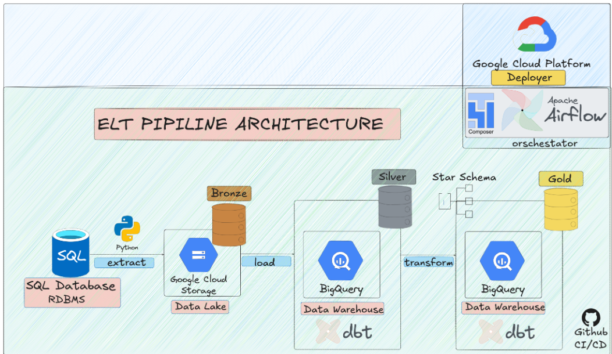
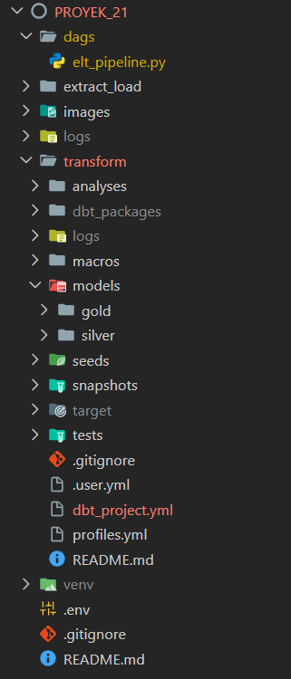

# END TO END ELT PIPELINE
## Chapter 1 - Project Overview

This project implements an end-to-end **ELT (Extract, Load, Transform)** data pipeline designed to process transactional data and transform it into analytics-ready datasets.

The pipeline extracts data from **PostgreSQL** using **Python**, stores raw data in **Google Cloud Storage** as the Bronze layer, loads it into **BigQuery** as the Silver layer, and performs transformations using **dbt** to produce curated Gold tables for analytics.

The workflow is orchestrated using **Apache Airflow** to ensure reliable scheduling, retries, and monitoring.

This project demonstrates several production-oriented data engineering practices such as:
- incremental loading
- idempotent pipelines
- logging
- retry mechanisms
- data quality validation
- CI/CD 
- Backfill
- monitoring and alerting
- SLA
- Data freshness
- data late arriving handling

 ## Chapter 2 - System Architecture

The pipeline follows a modern ELT architecture where raw data is extracted from a relational database and processed through multiple data layers.

The system consists of the following components:

1. **Source Database**
   A relational SQL database acts as the primary data source.

2. **Data Extraction**
   Python scripts extract data from the source database.

3. **Bronze Layer (Data Lake)**
   Raw data is stored in Google Cloud Storage as the Bronze layer.

4. **Silver Layer (Data Warehouse)**
   Data is loaded into BigQuery where basic cleaning and structuring occur.

5. **Gold Layer (Analytics Layer)**
   dbt transforms the data into analytical models using a star schema.

6. **Orchestration**
   Apache Airflow schedules and manages the pipeline execution.



## Chapter 3 - Tech Stack

This project uses the following technologies:

### Programming
- Python

### Data Source
- PostgreSQL

### Data Lake
- Google Cloud Storage (GCS)

### Data Warehouse
- BigQuery

### Data Transformation
- dbt (Data Build Tool)

### Orchestration
- Apache Airflow

### Data Modeling
- Star Schema
- medalion
### Version Control
- Git & GitHub

## CHapter 4 - Project Structure

The repository is organized as follows:

## Chapter 5 - Data Engineering Features

This project implements several production-oriented data engineering practices to ensure reliability, scalability, and maintainability of the data pipeline.

### Incremental Loading

The pipeline processes only new or updated records to reduce processing time and improve efficiency.

### Idempotent Pipelines

The pipeline is designed to produce consistent results even if the same task runs multiple times.

### Retry Mechanism

Apache Airflow automatically retries failed tasks to handle temporary system failures.

### Logging

Detailed logs are generated during pipeline execution to help monitor pipeline behavior and debug issues.

### Monitoring and Alerting

Pipeline execution can be monitored through Airflow task status and logs.

### Data Quality Validation

Data quality checks are implemented using dbt tests to ensure data accuracy and consistency.

### Backfill Capability

The pipeline supports backfilling historical data when needed.

### SLA Monitoring

Service Level Agreements (SLA) ensure that pipeline tasks complete within expected timeframes.

### Data Freshness

Data freshness checks ensure that downstream systems receive updated data regularly.

### Late Arriving Data Handling

The pipeline can handle delayed records by reprocessing data within a defined time window.

## Setup

Follow the steps below to set up the project locally.

### 1. Clone the repository

```bash
git clone https://github.com/rizkyangga-tech/ELT-end-to-end-project
cd elt-end-to-end-project
```

### 2. Create a virtual environment

```bash
python -m venv venv
source venv/bin/activate
```

For Windows:

```bash
venv\Scripts\activate
```

### 3. Install dependencies

```bash
pip install -r requirements.txt
```

### 4. Configure environment variables

Create a `.env` file and define required environment variables such as:

```
DB_HOST=your_database_host
DB_PORT=5432
DB_NAME=your_database_name
DB_USER=your_database_user
DB_PASSWORD=your_database_password
```

### 5. Configure dbt

Navigate to the dbt project folder:

```bash
cd transform
```

Run dbt dependency installation:

```bash
dbt deps
```
## Running the Pipeline

The pipeline is orchestrated using Google Cloud Composer, a managed Apache Airflow service on Google Cloud Platform.

### 1. Deploy DAG to Cloud Composer

Upload the DAG file to the Composer environment bucket:

```
dags/elt_pipeline.py
```

This will automatically deploy the DAG to the Airflow environment.

### 2. Access Airflow UI

Open the Cloud Composer environment and access the Airflow web interface from the Google Cloud Console.

### 3. Trigger the Pipeline

Locate the DAG named:

```
elt_pipeline
```

Trigger the DAG manually or wait for the scheduled execution.

### 4. Monitor Pipeline Execution

Use the Airflow UI to monitor task execution, logs, retries, and task dependencies.
